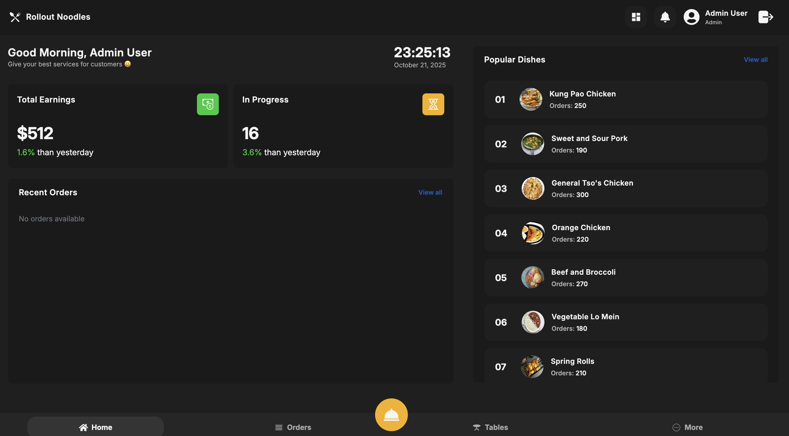
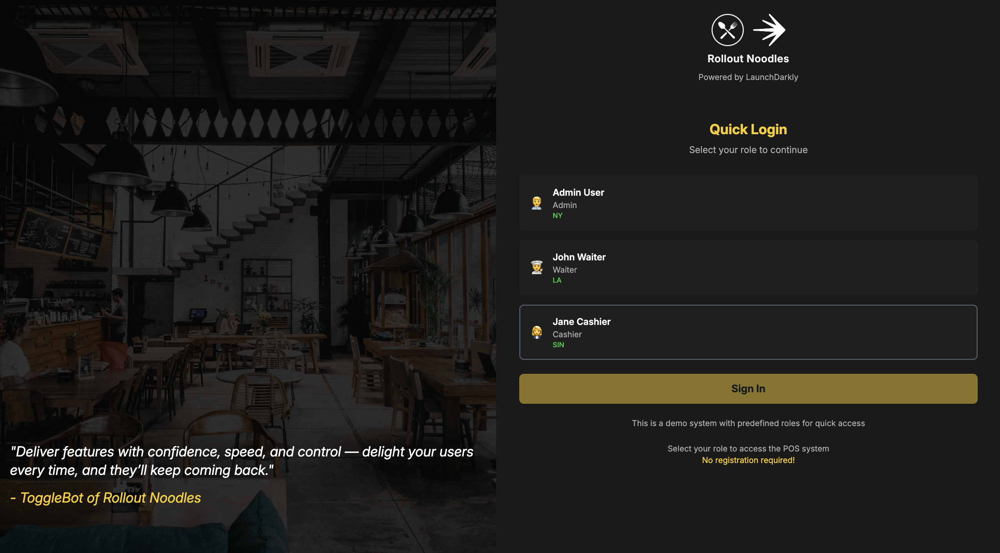
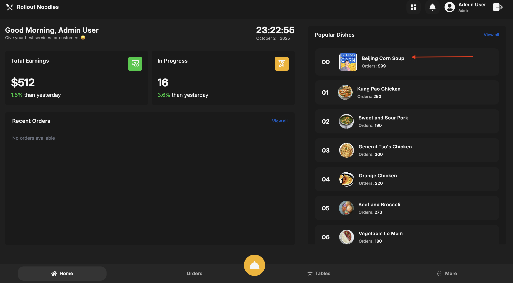
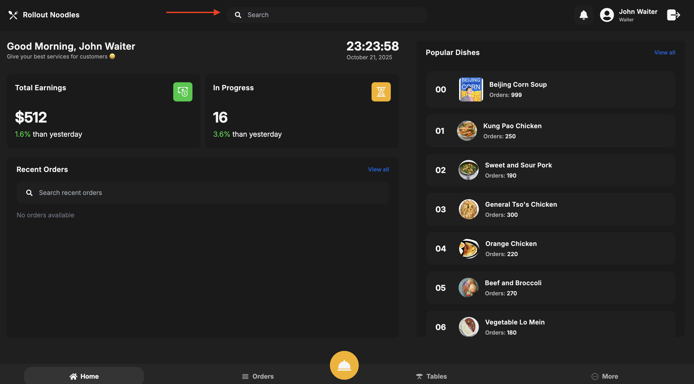

# 🍽️ **LaunchDarkly POS System**  

A **demo Restaurant POS System** built using **React, Node.js, and Express** with **LaunchDarkly Feature Flags** to showcase how feature flags can be used to control restaurant operations, user experience, and dynamic functionality.

## 🏗️ **Tech Stack**

| **Category**             | **Technology**                |
|--------------------------|-------------------------------|
| 🖥️ **Frontend**          | React.js, Redux, Tailwind CSS  |
| 🔙 **Backend**           | Node.js, Express.js           |
| 🚀 **Feature Flags**     | LaunchDarkly                  |
| 💾 **Data Storage**       | In-memory storage (demo data) |
| 🔐 **Authentication**    | JWT, bcrypt ** not implemented                   |
| 📊 **State Management**   | Redux Toolkit                 |
| 🔗 **APIs**              | RESTful APIs                   |


---

## 🚀 **Quick Start**

### **Prerequisites**
- Node.js (v16 or higher)
- npm or yarn
- LaunchDarkly account

### **1. Install Dependencies**
```bash
# Install all dependencies (root, backend, and frontend)
npm run install:all
```

### **2. LaunchDarkly Setup**

#### **Create Feature Flags in LaunchDarkly Dashboard:**
Create the following feature flags in your LaunchDarkly project:

| **Flag Key** | **Flag Name** | **Type** | **Default Value** | **Description** |
|--------------|---------------|----------|-------------------|-----------------|
| `beijing_corn_soup` | Beijing Corn Soup | Boolean | `false` | Enable/disable Beijing Corn Soup item |
| `search_bar_enabled` | Search Bar Enabled | Boolean | `false` | Show/hide search functionality |
| `timezone_offset` | Timezone Offset | Number | `0` | Timezone offset for time display |

#### **Update LaunchDarkly Client ID:**
1. Get your LaunchDarkly Client-side ID from your project settings
2. Update `pos-frontend/src/config/launchdarkly.js`:
```javascript
export const LAUNCHDARKLY_CONFIG = {
  CLIENT_ID: 'your-client-side-id-here', // Replace with your actual ID
  // ... rest of config
};
```

### **3. Start the Application**

#### **Option A: Start Both Services (Recommended)**
```bash
# Start both backend and frontend simultaneously
npm start
```

#### **Option B: Start Services Individually**
```bash
# Start only backend (port 3000)
npm run start:backend

# Start only frontend (port 5173+)
npm run start:frontend
```

### **4. Access the Application**
- **Frontend**: http://localhost:5173 (or next available port)
- **Backend API**: http://localhost:3000
- **Quick Login**: Use any of the predefined roles (Admin, Waiter, Cashier)

---

## 🔧 **Available Scripts**

| Command | Description |
|---------|-------------|
| `npm start` | Start both backend and frontend |
| `npm run dev` | Alias for `npm start` |
| `npm run start:backend` | Start only backend server |
| `npm run start:frontend` | Start only frontend development server |
| `npm run install:all` | Install dependencies for all projects |

---

## 🎯 **Feature Flag Usage**

The application uses LaunchDarkly feature flags to control:

- **Special Items**: Enable/disable Beijing Corn Soup menu item
- **Search Functionality**: Show/hide search bars in the interface
- **Timezone Display**: Adjust time display based on user timezone

### **Testing Feature Flags:**
1. Login with different user roles (Admin, Waiter, Cashier)
2. Toggle flags in LaunchDarkly dashboard
3. Observe real-time changes in the demo application
4. Test different user contexts and timezone displays
5. See how feature flags control UI elements and functionality

---

## 🏗️ **Project Structure**

```
LaunchDarklyPOS/
├── pos-backend/          # Node.js/Express backend
│   ├── controllers/       # API route handlers
│   ├── routes/           # API routes
│   ├── data/             # In-memory data storage
│   └── middlewares/      # Custom middleware
├── pos-frontend/         # React frontend
│   ├── src/
│   │   ├── components/   # React components
│   │   ├── contexts/     # LaunchDarkly context
│   │   ├── hooks/        # Custom React hooks
│   │   ├── config/       # LaunchDarkly configuration
│   │   └── redux/        # Redux store and slices
└── package.json          # Root package with start scripts
```

---

## 🎨 **Design Inspiration**

- 💡 **UI/UX Design Reference:** [Behance Design](https://www.behance.net/gallery/210280099/Restaurant-POS-System-Point-of-Sale-UIUX-Design)

---

## 🖼️ **Project Screenshots**


*Main dashboard interface after login*


*Role-based quick login interface*


*LaunchDarkly feature flag controlling Beijing Corn Soup menu item*


*LaunchDarkly feature flag controlling search functionality*


---

## 🤝 **Contributing**

1. Fork the repository
2. Create your feature branch (`git checkout -b feature/AmazingFeature`)
3. Commit your changes (`git commit -m 'Add some AmazingFeature'`)
4. Push to the branch (`git push origin feature/AmazingFeature`)
5. Open a Pull Request

---

## 📄 **License**

This project is licensed under the MIT License - see the [LICENSE](LICENSE) file for details.